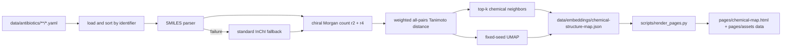

pyenv: cannot rehash: /Users/marcin/.pyenv/shims isn't writable
# Chemical-structure embedding map: implementation plan

- **Plan date:** 2026-08-30
- **Planning branch:** `plan/chemical-embedding-model`
- **Decision source:** [chemical-structure embedding decision](2026-08-30-chemical-structure-embedding-model.md)
- **Benchmark source:** [machine-readable benchmark](2026-08-30-chemical-embedding-benchmark.json)
- **Tracking issue:** [#101](https://github.com/CultureBotAI/AntibioticMech/issues/101)
- **Implementation baseline:** `3e230ea1c1d7eeda5ce39399ad6b464465e9c8fa`
- **Status:** implemented and verified on the planning branch; tracked by #101

## Outcome

Add a distinct, reproducible **Chemical structure map** to the generated
AntibioticMech site. Point positions and nearest neighbors will depend only on
the exact chemical structure stored by each record:

```text
distance(i, j)
  = 0.90 × (1 - Tanimoto(chiral Morgan count r2(i), r2(j)))
  + 0.10 × (1 - Tanimoto(chiral Morgan count r4(i), r4(j)))
```

The two-dimensional projection will use UMAP over the complete precomputed
distance matrix:

```text
metric=precomputed, n_neighbors=15, min_dist=0.05,
n_components=2, random_state=42
```

The map may display or filter on record metadata, but metadata must never enter
the fingerprint, chemical distance, nearest-neighbor ranking, or coordinates.
This is the hard boundary separating the chemical map from the text-embedding
map being developed independently.

## Scope

The first release will:

- include exactly the identifiers in the corpus lockfile;
- parse stored SMILES first and standard InChI as the required fallback;
- preserve charge, stereochemistry, counterions, and fragments exactly as
  represented by each record;
- generate deterministic coordinates and nearest-neighbor data on CPU;
- publish a searchable, keyboard-accessible static map under `pages/`;
- commit generated artifacts and fail QC when they are stale;
- expose configuration, tool versions, corpus hash, input path, and quality
  metrics in machine-readable metadata.

The first release will not:

- neutralize, desalt, choose a largest fragment, or otherwise rewrite records;
- use class, mechanism, target, label, prose, or curation status as model input;
- replace the text or knowledge-graph map;
- introduce MoLFormer, MAP4, ChemBERTa, or another learned primary embedding;
- claim that 2D proximity predicts mechanism or antimicrobial activity;
- add a generated-conformer 3D view. A future Uni-Mol view would be a separate,
  explicitly provenance-labeled product.

## Architecture



One importable module will own chemistry and projection logic. A thin command
will own CLI behavior and artifact writes. The existing renderer will own
publication, navigation, and site staleness checks. This keeps scientific logic
testable without importing the site generator.

## Production contract

### Parsing

For every record:

```python
mol = Chem.MolFromSmiles(smiles)
structure_input = "SMILES"
if mol is None:
    mol = Chem.MolFromInchi(standard_inchi)
    structure_input = "INCHI_FALLBACK"
if mol is None:
    raise StructureEmbeddingError(identifier)
```

The generator must fail the whole build, not skip a record, if both inputs fail.
It must report the count and identifiers using the InChI fallback. The research
baseline was 176 fallbacks and zero failures among 2,923 records; this number is
diagnostic, not a permanently hard-coded assertion.

No standardization step may occur between parsing and fingerprinting. Corpus
corrections for mixture or combination-product records belong in the source
pipeline (see issue #90), not in visualization code.

### Representation and distance

Use RDKit sparse count fingerprints with:

- radius 2 and radius 4;
- `includeChirality=True`;
- `useCounts=True`;
- the same invariant and bond-type settings for both channels;
- no folding into a fixed bit vector.

Compute each complete Tanimoto similarity matrix using RDKit bulk similarity,
convert it to distance, and combine the channels in `float32`. Enforce a zero
diagonal and symmetry after combination. Version every representation or
weight change.

Initial representation version:

```text
morgan-count-chiral-r2_0.90-r4_0.10+tanimoto
```

### Projection

Fit UMAP to the combined precomputed distance matrix. Sort records by identifier
before fitting, use `random_state=42`, and run the seeded path with one worker.
Round published coordinates to six decimal places only after all evaluation and
neighbor computations.

Initial projection version:

```text
umap-precomputed-n15-d0.05-c2-rs42
```

Coordinates are deterministic for a pinned environment and exact input set, not
permanent identifiers. Adding records, changing RDKit or UMAP, or changing the
configuration requires regeneration and may move every point.

### Artifact

The canonical generated artifact will be
`data/embeddings/chemical-structure-map.json`. It will contain:

```json
{
  "schema_version": 1,
  "model_version": "morgan-count-chiral-r2_0.90-r4_0.10+tanimoto+umap-precomputed-n15-d0.05-c2-rs42",
  "generated_from_commit": "...",
  "input_hash": "...",
  "record_count": 2923,
  "versions": {
    "python": "...",
    "rdkit": "...",
    "numpy": "...",
    "scikit_learn": "...",
    "umap": "..."
  },
  "configuration": {
    "radii": [2, 4],
    "weights": [0.9, 0.1],
    "chirality": true,
    "neighbors": 15,
    "min_dist": 0.05,
    "random_state": 42
  },
  "quality": {
    "trustworthiness_at_10": 0.0,
    "neighbor_overlap_at_10": 0.0,
    "inchi_fallback_count": 0,
    "multifragment_count": 0
  },
  "records": [
    {
      "identifier": "CHEBI:...",
      "path": "antibacterial/example.html",
      "label": "display only",
      "canonical_isomeric_smiles": "...",
      "structure_input": "SMILES",
      "x": 0.0,
      "y": 0.0,
      "neighbors": [
        {"identifier": "CHEBI:...", "distance": 0.0}
      ]
    }
  ]
}
```

The public JSON will not contain fingerprints or the full pairwise matrix.
Those are build intermediates and would make the artifact unnecessarily large.
If profiling shows fingerprint caching is useful, put a versioned cache under
an ignored `.cache/chemical-map/` directory and never make correctness depend
on its presence.

`input_hash` will be SHA-256 over canonical JSON containing the sorted
identifier, stored SMILES, standard InChI, model configuration, and dependency
versions. Labels and every non-structure field are excluded. The artifact
writer will use sorted keys, stable record ordering, compact separators, one
terminal newline, and fixed float formatting so `--check` can byte-compare.

## Repository changes

| Path | Change |
|---|---|
| `pyproject.toml`, `uv.lock` | Add a `chemical-map` extra with RDKit, NumPy, scikit-learn, and umap-learn; keep neural-model dependencies out. |
| `src/antibioticmech/chemical_embedding.py` | Pure parsing, fingerprint, distance, projection, metric, hashing, and serialization functions. |
| `scripts/generate_chemical_map.py` | Thin CLI with normal write mode, `--check`, `--out`, and useful failure summaries. |
| `data/embeddings/chemical-structure-map.json` | Commit the canonical generated artifact. |
| `src/antibioticmech/templates/chemical_map.html` | Static map page and explanatory copy. |
| `src/antibioticmech/templates/chemical_map.js` | Dependency-free Canvas interaction, search, filters, selection, and accessible result list. |
| `src/antibioticmech/templates/style.css` | Map layout, legend, focus, reduced-motion, and small-screen rules. |
| `scripts/render_pages.py` | Render the map page, copy its JS/data, include it in pruning, sitemap, and `--check`. |
| `src/antibioticmech/templates/base.html` | Add a distinct “Chemical map” navigation item. |
| `pages/chemical-map.html`, `pages/chemical-map.js`, `pages/data/chemical-structure-map.json` | Commit generated public assets. |
| `tests/test_chemical_embedding.py` | Unit and scientific-invariant tests. |
| `tests/test_chemical_map_site.py` | Artifact/site linkage and accessibility smoke tests. |
| `scripts/run_qc.py` | Add the chemical-artifact currency/quality gate before generated-site comparison. |
| `justfile`, `.github/workflows/main.yaml` | Install the optional extra and expose `chemical-map` / `chemical-map-check` recipes. |
| `README.md` | Document generation, interpretation, and the site entry point. |

The implementation should first check whether the parallel text-map branch has
introduced shared `data/embeddings/` conventions or a common visualization
shell. Reuse naming, navigation, and UI utilities where helpful, but do not
share feature inputs or coordinates.

## Dependency strategy

Add a dedicated optional extra rather than placing cheminformatics packages in
the runtime library dependency set:

```toml
chemical-map = [
  "numpy>=1.26",
  "rdkit>=2025.3",
  "scikit-learn>=1.5",
  "umap-learn>=0.5.7",
]
```

`uv.lock` will pin the exact build environment. Update `just install`, CI
sync, and the `qc` recipe to include both `dev` and `chemical-map`. The
artifact metadata must still record resolved versions because a lockfile update
may legitimately change coordinates.

Do not add pandas, PyTorch, transformers, MAP4, or a JavaScript plotting
framework for the first release.

## Implementation phases

### 1. Core chemistry module

Implement typed records and small pure functions for:

1. loading structures in stable identifier order;
2. SMILES/InChI parsing with explicit provenance;
3. canonical isomeric SMILES generation;
4. chiral Morgan count fingerprints at both radii;
5. weighted pairwise distance construction;
6. top-k neighbor selection with stable identifier tie-breaking;
7. UMAP projection and quality metrics;
8. input hashing and deterministic serialization.

Acceptance criteria:

- a corpus build returns one result for every lockfile identifier;
- all 189 research stereoisomer pairs have nonzero combined distance on the
  benchmark corpus;
- changing labels, definitions, mechanisms, or classes cannot change the
  structure result;
- unit tests use small fixtures and do not require a 2,923-record UMAP run.

### 2. Generator and committed artifact

Add the CLI and generate the complete artifact. The normal command writes via a
temporary file followed by an atomic replace. `--check` generates to a
temporary location and emits a concise metadata or first-difference summary
without modifying the worktree.

Acceptance criteria:

- two clean runs in the locked environment are byte-identical;
- `--check` passes immediately after generation and fails after changing a
  structure, model parameter, or dependency-version field;
- failure output names unparseable records and does not leave partial output;
- peak memory and wall time are printed. Target: under 1 GiB and under two
  minutes for 2,923 records on a normal developer CPU.

For the current corpus, two 2,923 × 2,923 `float32` matrices are about 68 MB
total. Reuse buffers and release channel-specific matrices before UMAP to keep
peak memory modest. An approximate-neighbor design is unnecessary at this size;
revisit it only when the exact matrix is no longer operationally comfortable.

### 3. Scientific regression gate

Run full-corpus assertions in the artifact generation/check path:

- identifier coverage equals `data/antibiotics/PATHS.tsv`;
- trustworthiness at 10 is at least 0.95;
- high-dimensional/2D neighbor overlap at 10 is at least 0.45;
- every detected same-connectivity/different-isomeric-SMILES pair has nonzero
  distance;
- duplicate InChIKey groups and multi-fragment records are reported;
- named canaries retain chemically plausible neighbors.

Canary tests should assert a small family-level condition, not one brittle exact
ordering. Examples: erythromycin A has an erythromycin derivative in its first
10 neighbors; vancomycin has a glycopeptide relative; ciprofloxacin has a close
fluoroquinolone; tetracycline has a tetracycline derivative.

Rerun and archive the benchmark on the implementation baseline. The memo used
corpus commit `c93b3e40`, whereas this plan starts from `3e230ea1`; no
historical score should be silently presented as a fresh build result.

### 4. Static site view

Render a dedicated page with:

- a plain-language statement that position uses chemical structure only;
- a Canvas plot for responsive performance with roughly 3,000 points;
- search by label, identifier, and synonym;
- metadata-based coloring and filtering that never recomputes coordinates;
- selectable points, a nearest-neighbor list with distances, and record links;
- an always-available tabular/list representation for keyboard and screen-reader
  use;
- a mixture/multi-fragment badge and structure-input provenance;
- a legend, reset control, URL state for the selected record, and clear empty
  states.

Use plain browser JavaScript and committed local assets. Do not add CDN calls,
analytics, or runtime network dependencies. Respect `prefers-reduced-motion`
and do not encode class by color alone.

Acceptance criteria:

- all record and neighbor links resolve inside the rendered site;
- the page remains usable without pointer input;
- filters alter visibility and color only, never point coordinates;
- the generated-site marker/pruning logic knows every new asset;
- `render_pages.py --check` detects any stale map page, script, or data copy.

### 5. QC, documentation, and release

Add `chemical-map` and `chemical-map-check` recipes. Insert the full artifact
check into `scripts/run_qc.py` before the generated-site check, then document
the workflow and interpretation in the README.

Recommended command contract:

```bash
just chemical-map          # regenerate canonical artifact, then render site
just chemical-map-check    # recompute and compare without writes
just qc                    # includes chemical-map-check and render-check
```

Acceptance criteria:

- a fresh clone can install, regenerate, and pass QC using documented commands;
- CI uses the same locked dependencies and command as local QC;
- the site navigation labels the view “Chemical map,” not simply “Embedding”;
- release notes state that global coordinates can change when the corpus or
  model version changes.

## Test matrix

| Level | Required checks |
|---|---|
| Unit | SMILES success, InChI fallback, dual failure, chirality enabled, exact-fragment preservation, stable ties, stable hash, deterministic JSON. |
| Invariance | Randomized valid SMILES for one molecule produce identical fingerprints/distances; blanked non-structure metadata produces identical chemical output. |
| Corpus | Exact identifier coverage, parse provenance counts, stereo separation, duplicate/multifragment reporting, no NaN/Inf, symmetric distances. |
| Projection | Fixed configuration/version, trustworthiness ≥ 0.95, neighbor overlap ≥ 0.45, two-run byte equality in the lockfile environment. |
| Site | JSON schema, internal links, accessible controls/list, no third-party hosts, filters do not mutate coordinates. |
| Staleness | Structure/config/version changes fail `--check`; label-only changes require re-rendering display metadata but leave the structure hash and coordinates unchanged. |

The final staleness case requires two hashes: a **structure/model hash** that
governs expensive recomputation and a **display hash** that covers label, URL,
and filter fields. A label change should refresh the published artifact without
pretending the chemical model changed.

## Risks and controls

| Risk | Control |
|---|---|
| RDKit or UMAP upgrades move the map | Pin in `uv.lock`, record versions, version the artifact, require explicit regeneration. |
| UMAP visually overstates global distance | Explain that local neighborhoods are meaningful and axes/global spacing are not quantitative. |
| Salt, hydrate, and mixture records dominate some neighborhoods | Preserve exact repository identity; visibly badge fragments; fix invalid combinations at the corpus layer. |
| Internal class/scaffold labels are weak evaluation proxies | Keep multiple metrics, named canaries, and thresholds; do not call them ground truth. |
| Metadata leaks into chemical coordinates | Centralize a structure-only input type and add byte-identical blank-metadata tests. |
| Exact O(N²) distances stop scaling | Record runtime/memory; introduce an explicit approximate-neighbor design only after measured need. |
| Parallel text-map work conflicts in navigation/assets | Rebase before UI work and share only presentation primitives, never representation code or data. |
| Static JSON becomes too large | Publish only coordinates, display fields, and top-k neighbors; gzip is handled by hosting, and fingerprints/matrix stay build-only. |

## Issue-ready work packages

The implementation can be reviewed as five independently testable pull
requests:

1. **Chemical embedding core and dependency lock** — module, unit tests, and
   structure-only input contract.
2. **Deterministic full-corpus generator** — artifact schema, CLI, metrics,
   complete generated JSON, and benchmark refresh.
3. **Chemical map static UI** — renderer integration, Canvas/list interaction,
   navigation, and accessibility tests.
4. **Artifact staleness and authoritative QC** — `--check`, Just recipes, CI,
   full-corpus quality thresholds, and generated-site coverage.
5. **Documentation and release review** — README, interpretation caveats,
   performance record, and final corpus/mixture audit linkage.

Packages 1 and 2 are sequential. UI scaffolding may begin after the artifact
schema in package 2 is frozen. Packages 4 and 5 follow the generated artifact
and site integration.

## Definition of done

The feature is complete when:

- the locked environment parses and embeds every in-scope record or fails;
- coordinates use only the selected chiral Morgan/Tanimoto model;
- the committed canonical and public artifacts are deterministic and current;
- scientific regression thresholds and canaries pass on the live corpus;
- the generated static page is accessible, searchable, dependency-free at
  runtime, and linked from site navigation;
- `just qc` regenerates/checks the artifact and passes;
- documentation names the model, limitations, versions, provenance, fallback
  count, and distinction from the text map;
- mixture/combination records remain visible as corpus-quality concerns rather
  than being silently chemically normalized.
